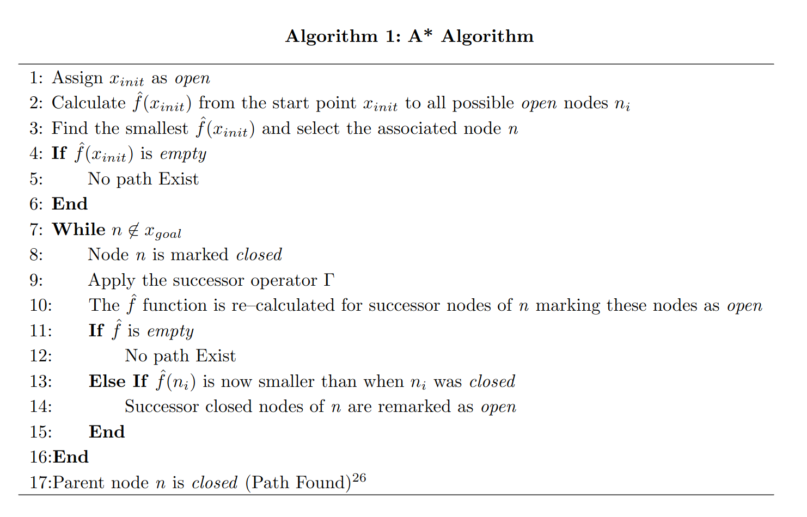
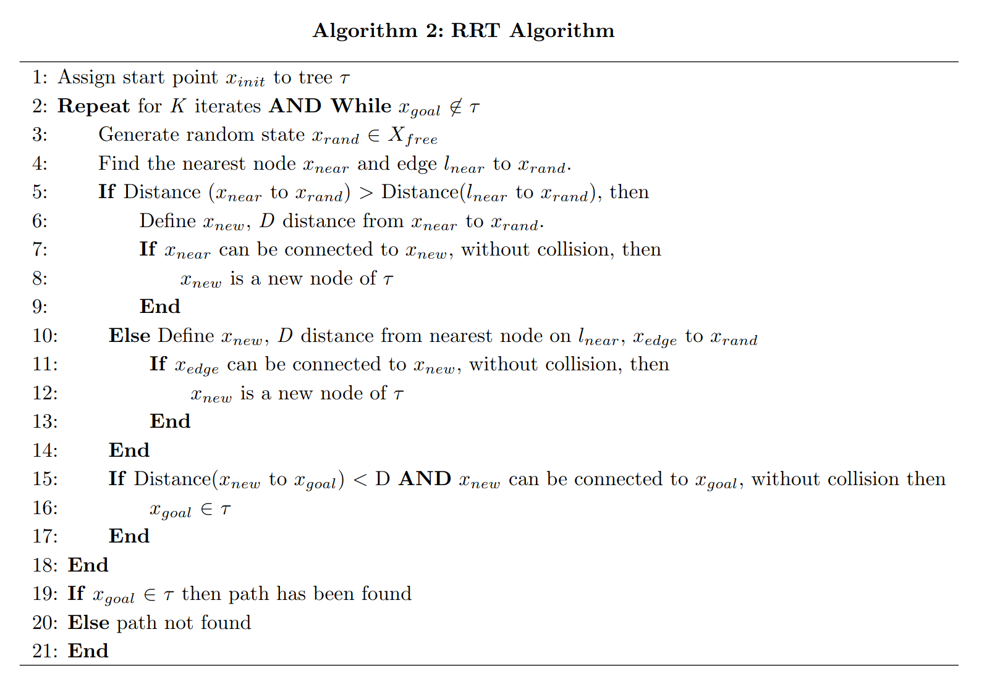
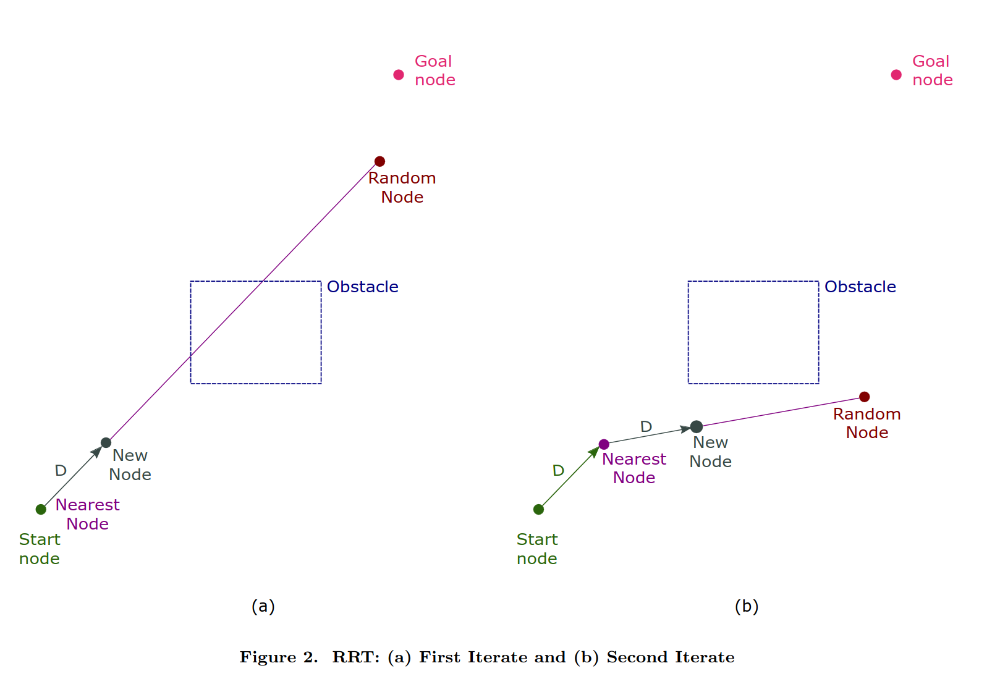
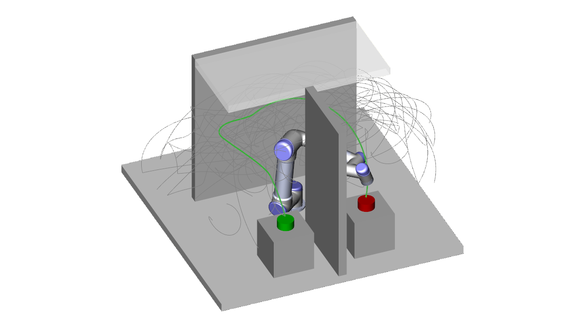

## Tutorial 5

What makes sampling based planners different from dijkstras (UCS) or A*?

* As discussed last week UCS and A* can take up alot of memory unless your heuristic is very good or the problem is relatively small. 

* For higher dimentionality space it is more important that a solution is found rather than an optimal one so sampling based planners are more common.

Here is a great link if you would like to read more in depth:
https://pure.tudelft.nl/ws/files/40690538/Comparison_between_Astar_and_RRT_Algorithms_for_UAV_Path_Planning.pdf

As RRT is random we must check if the random nodes are reachable as this ia not guaranteed as in the node expansion of A*:

RRT and PRM motion planners are used heavily in robotic arm motion planning as usually this must occur at a high frequency and optimality is not as important:
 

PRM planners return a roadmap which can then be evaluated for paths using A*, just remember this is an application of A* on the roadmap not the original environment making it less computationally expensive. 

Sampled motion results can then be optimized using simple algorithms like smoothing or further distance reduction. Although this does not make them optimal like A* it is close enough. As discussed in the lectures there exists a version of PRM namely PRM* that guarantees to by asymptotically optimal as sampling increases, this is what we will be implementing in this tute.